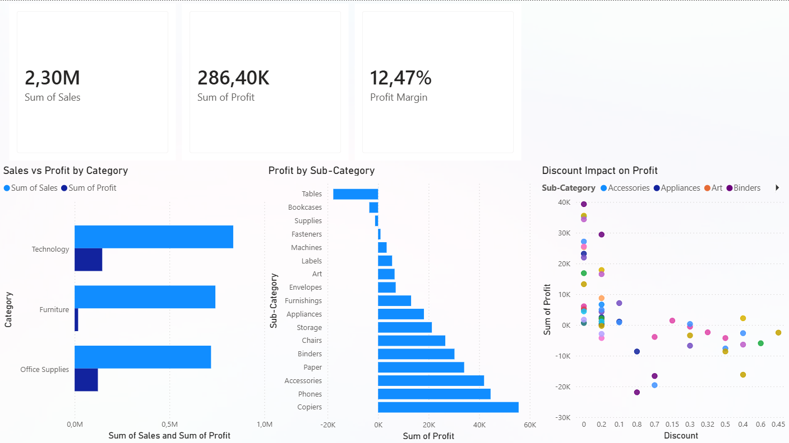

# Sales Data Analysis – Business Performance

## 📌 Project Overview
This project analyzes retail sales data to understand business performance and identify key issues affecting profitability.

## 🎯 Objective
The goal was to find which products and categories generate profit and which lead to losses.

## 🧰 Tools
- Python
- Pandas
- Matplotlib

## 🔍 Approach

### Data Analysis
The dataset contains around 10,000 sales records with 19 columns.

Key fields include:
- Sales – total revenue
- Profit – profit from each order
- Discount – discount applied to the order
- Category and Sub-Category – product classification

### Exploratory Analysis
- Total sales are high (~2.3M), but profit is relatively low (~12.5%)
- Sales are similar across categories, but profitability differs

### Category Analysis
- Furniture generates a large share of sales but very little profit
- Technology is the most profitable category

### Sub-Category Analysis
- Tables, Bookcases, and Supplies generate losses
- Some products have negative profit margins

### Profit Margin Analysis
- Profit margin varies significantly across products
- Some categories have negative margins, while others (e.g. Copiers) are highly profitable

### Discount vs Profit
- Higher discounts generally reduce profitability
- However, some categories (e.g. Supplies) generate losses even with low discounts

## 📊 Key Insights
- High sales do not guarantee high profit
- Furniture is the least efficient category
- Some products consistently generate losses
- Discounts are a major factor affecting profitability

## ⚠️ Limitations
- Analysis is based on historical data only
- No predictive modeling was used

## 🚀 Next Steps
- Build a profit prediction model
- Analyze customer segments
- Create a dashboard for business users
